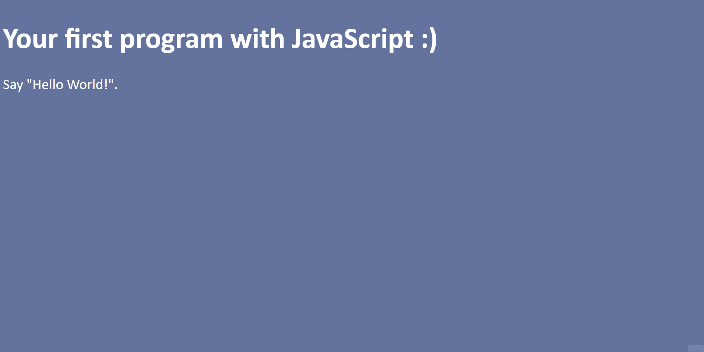

<h1 align="center">Primeiro Script 1️⃣</h1>

    <a href="https://elias-neto.github.io/Curso-em-video-JavaScript/moduloA/aula04/index.html" target="_blank"> Veja o Site</a>

 

## 💻 Projeto

Um script simples apenas para marcar meu primeiro contato com a JavaScript na Web.

 

## 📥 Conhecimento Adquirido 

- Método `window.alert()`;
- Método `window.confirm()`;
- Método `window.prompt()`;

 

## 🛠 Tecnologias Usadas

- [HTML](https://www.w3schools.com/html/)
- [CSS](https://www.w3schools.com/css/)
- [JavaScript](https://www.w3schools.com/js/)

 

 Desenvolvido com 💙 por Elias de Araújo Ferreira Neto 👋 

 
  
<a href="../../README.md">Voltar</a>