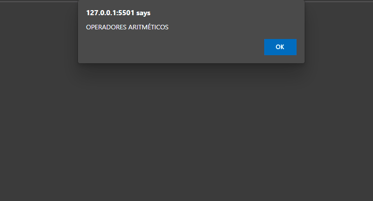

<h1 align="center">Operadores (Parte 1) 🔢</h1>

  <a href="https://elias-neto.github.io/Curso-em-video-JavaScript/moduloB/aula07/index.html">Veja o Site</a>

 

## 💻 Projeto

Programa simples que ler 2 números e faz algumas operações aritméticas com eles.

 

## 📥 Conhecimento Adquirido 

- Operadores Aritméticos;
- Formatar números reais por meio do método .toFixed();
- Ordem de precedência;
- Operador de atribuição simples;
- Operadores de auto-atribuição;
- Operadores de incremento e decremento;

 

## 🛠 Tecnologias Usadas

- [HTML](https://www.w3schools.com/html/)
- [CSS](https://www.w3schools.com/css/)
- [JavaScript](https://www.w3schools.com/js/)

 

 Desenvolvido com 💙 por Elias de Araújo Ferreira Neto 👋 

 
  
<a href="../../README.md">Voltar</a>