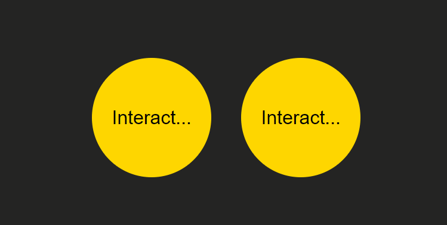

<h1 align="center">Eventos DOM 🖇</h1>

  <a href="https://elias-neto.github.io/Curso-em-video-JavaScript/moduloC/aula10/index.html">Veja o Site</a>

## 💻 Projeto

Nesse programa o intuito é treinar os Eventos DOM. Ao colocar o cursor do mouse dentro do círculo, dispara-se um evento, 
ao tira-lo de dentro, dispara-se outro evento, ao clicar no círculo, dispara-se mais um evento.

No círculo da esquerda eu coloquei os disparos de evento no próprio html. Já no da direita, eu adicionei event listener's para dispararem os eventos.

 

## 📥 Conhecimento Adquirido 

- Entendendo o DOM e a Árvore DOM;
- Selecionar elementos da Árvore DOM;
- Manipulação de elementos utilizando o DOM.

 

## 🛠 Tecnologias Usadas

- [HTML](https://www.w3schools.com/html/)
- [CSS](https://www.w3schools.com/css/)
- [JavaScript](https://www.w3schools.com/js/)

 

 Desenvolvido com 💙 por Elias de Araújo Ferreira Neto 👋 

 
  
<a href="../../README.md">Voltar</a>