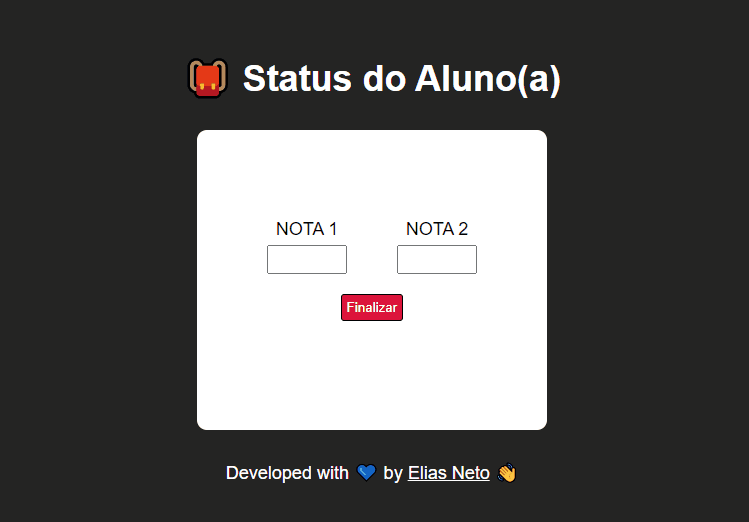

<h1 align="center">Condições (Parte 2) 🔀</h1>

  <a href="https://elias-neto.github.io/Curso-em-video-JavaScript/moduloC/aula12/index.html">Veja o Site</a>

 

## 💻 Projeto

Essa é uma aplicação que calcula a média de um aluno(a) e informa seu status (Aprovação (media >= 7), Recuperação (media >= 5) ou Reprovação (media < 5>)).

Nessa aplicação, o usuário irá digitar o valor da nota 1 e da nota 2. Automaticamente, será calculado a média entre as duas nota e, a partir daí, será exibido 
o status do aluno(a).

 

## 📥 Conhecimento Adquirido 

- Estrtura Condicional Aninhada;

 

## 🛠 Tecnologias Usadas

- [HTML](https://www.w3schools.com/html/)
- [CSS](https://www.w3schools.com/css/)
- [JavaScript](https://www.w3schools.com/js/)

 

 Desenvolvido com 💙 por Elias de Araújo Ferreira Neto 👋 

 
  
<a href="../../README.md">Voltar</a>