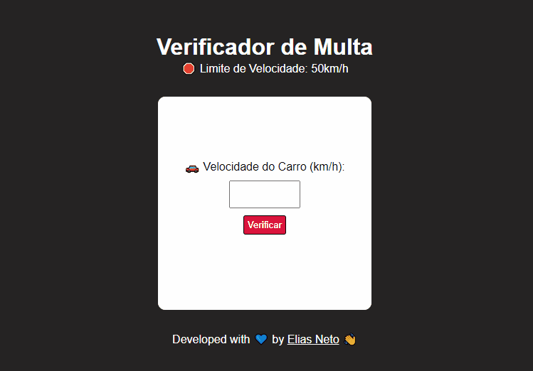

<h1 align="center">Aula 11 - Condições (Parte 1) 🔀</h1>

  

  <a href="https://elias-neto.github.io/Curso-em-video-JavaScript/moduloC/aula11/index.html">Veja o Site</a>

 

## 💻 Projeto

Esse é um aplicativo que ler a velocidade de um carro e verifica: se ultrapasou a velocidade limite, informa ao usuário que
ele foi multado, calcula e mostra o valor da multa; se não, informa ao usuário que ele não foi multado.

 

## 📥 Conhecimento Adquirido 

- Estrtura Condicional Simples;
- Estrutura Condicional Composta;

 

## 🛠 Tecnologias Usadas

- [HTML](https://www.w3schools.com/html/)
- [CSS](https://www.w3schools.com/css/)
- [JavaScript](https://www.w3schools.com/js/)

 

 Desenvolvido com 💙 por Elias de Araújo Ferreira Neto 👋 

 
  
<a href="../../README.md">Voltar</a>