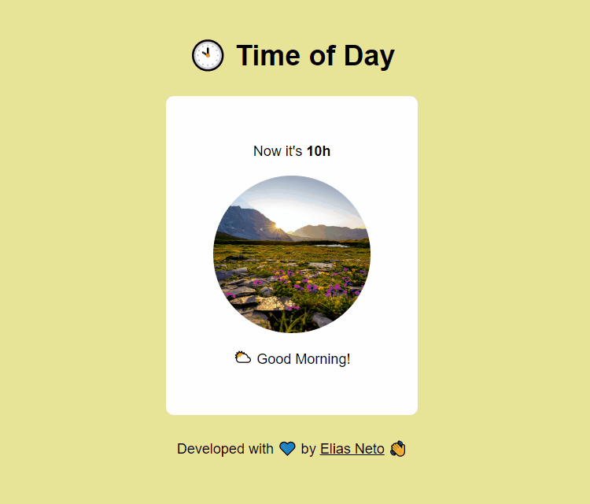

<h1 align="center">Exercícios 🏋️‍♂️</h1>

  

  <a href="https://elias-neto.github.io/Curso-em-video-JavaScript/moduloD/exercicios/exercicio1.html">Veja o Site</a>

 

## 💻 Projeto

Esse aplicativo identifica qual é a hora do seu sistema operacional, informa a hora, e muda a imagem e a saudação (dependendo 
da hora do dia: manhã, tarde e noite).

 

## 📥 Conhecimento Adquirido 

- Manipulação de elementos do DOM;
- Utilização do objeto `Date()`;
- Estrutura Condicional Composta;

 

## 🛠 Tecnologias Usadas

- [HTML](https://www.w3schools.com/html/)
- [CSS](https://www.w3schools.com/css/)
- [JavaScript](https://www.w3schools.com/js/)

 

 Desenvolvido com 💙 por Elias de Araújo Ferreira Neto 👋 

 
  
<a href="../../README.md">Voltar</a>