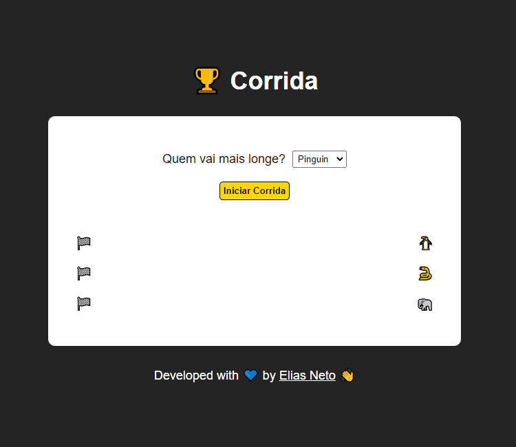
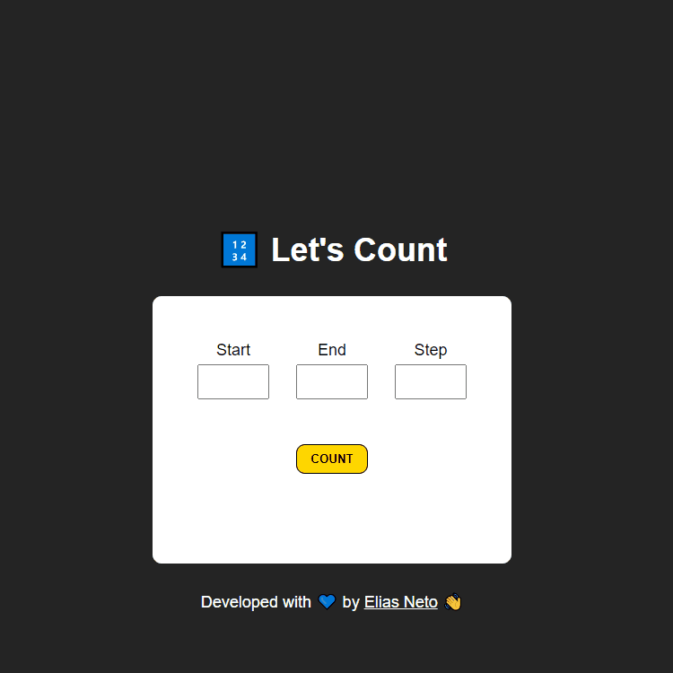
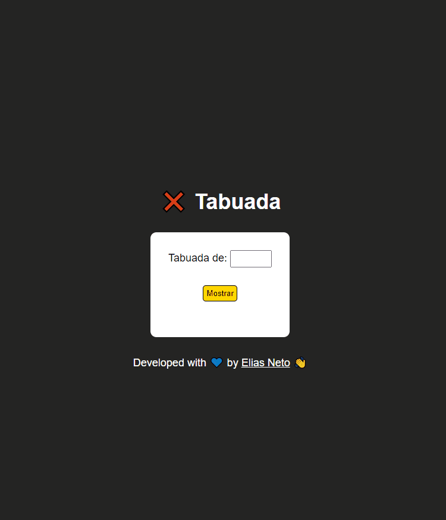

<h1 align="center">Exercícios 🏋️‍♂️</h1>

  

  <a href="https://elias-neto.github.io/Curso-em-video-JavaScript/moduloE/exercicios/corrida/index.html">Veja o Site</a>

 

## 💻 Projeto

- A ideia desse projeto foi fazer um joguinho de palpite. 
- Nele o usuário seleciona quem ele acha que vai chegar mais longe na corrida e aperta no botão "Iniciar Corrida".
- O jogo foi programado para que todos os corredores recebam velocidades aleatórias e cheguem a distâncias aleatórias.
- Além disso, programei para que não houvesse a possibilidade de empate, ou seja, sempre um dos três corredores irá chegar mais longe.
- Ao final da corrida, o usuário será informado se seu palpite foi certo ou errado.

 

## 📥 Conhecimento Adquirido 

- Trabalhar com o objeto interno do JavaScript, `Math`;
- Formatar números reais com o método `Math.floor()`;
- Gerar números aleatórios com o método `Math.random()`;
- Estrturas de Repetição;
- Estrturas de Condição;
- Declaração e atribuição de valores em Array's;
- Trabalhar utilizando o tamanho de um Array por meio da propriedade `nomeDoArray.length`;
- Trabalhar com Funções;
- Trabalhar com a função interna do JavaScript `setInterval()` e `clearInterval()`;
- Manipulação de um elemento `<select>` e `<option>` com o DOM;

 

## 🛠 Tecnologias Usadas

- [HTML](https://www.w3schools.com/html/)
- [CSS](https://www.w3schools.com/css/)
- [JavaScript](https://www.w3schools.com/js/)

 

  

  <a href="https://elias-neto.github.io/Curso-em-video-JavaScript/moduloE/exercicios/exercicio1.html">Veja o Site</a>

 

## 💻 Projeto

Esse programa ler o início, o fim e o passo de uma contagem. Com esses dados, ele faz a contagem (progressiva ou regressiva). Além disso, ele alerta se houver erro de
falta de dados ou erro de colocar um passo menor ou igual a 0.

 

## 📥 Conhecimento Adquirido 

- Estruturas de Repetição;

 

## 🛠 Tecnologias Usadas

- [HTML](https://www.w3schools.com/html/)
- [CSS](https://www.w3schools.com/css/)
- [JavaScript](https://www.w3schools.com/js/)

 

  

  <a href="https://elias-neto.github.io/Curso-em-video-JavaScript/moduloE/exercicios/exercicio2.html">Veja o Site</a>

 

## 💻 Projeto

Esse programa ler um número e calcula a tabuada do mesmo. Caso o usuário não digite um número, ele emite um alerta.

 

## 📥 Conhecimento Adquirido 

- Estruturas de Repetição;

 

## 🛠 Tecnologias Usadas

- [HTML](https://www.w3schools.com/html/)
- [CSS](https://www.w3schools.com/css/)
- [JavaScript](https://www.w3schools.com/js/)

 

 Desenvolvido com 💙 por Elias de Araújo Ferreira Neto 👋 

 
  
<a href="../../README.md">Voltar</a>