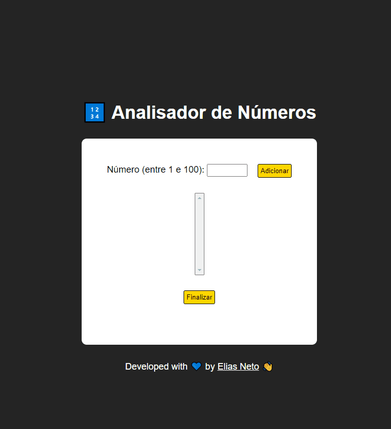

<h1 align="center">Exercícios 🏋️‍♂️</h1>

  

  <a href="https://elias-neto.github.io/Curso-em-video-JavaScript/moduloF/analisador_de_numeros/index.html">Veja o Site</a>

 

## 💻 Projeto

- Essa aplicação permite o usuário adicionar quantos números ele quiser a uma lista que será analisada ao clicar em "Finalizar".
- Quando um número é adicionado ele aparece na lista.
- Caso o número não esteja dentro do intervalo desejado ou se o usuário deixar o campo em branco e clique em adiconar, será alertado
um erro.
- Ao clicar em finalizar, o sistema irá informar:
  - Quantos números foram adicionados;
  - O maior e o menor número adicionado;
  - A soma e a média de entre os números.
- Após finalizar, o usuário poderá adicionar mais números se quiser.

 

## 📥 Conhecimento Adquirido 

- Trabalhar com Funções;
- Trabalhar com Arrays's;
- Identificar a quantidade de elementos num Array por meio da propriedade `nomeDoArray.length`;
- Verificar se um determinado valor existe dentro dum Array por meio do método `nomeDoArray.indexOf()`;
- Adicionar um elemento dentro de um Array por meio do método `nomeDoArray.push()`;

 

## 🛠 Tecnologias Usadas

- [HTML](https://www.w3schools.com/html/)
- [CSS](https://www.w3schools.com/css/)
- [JavaScript](https://www.w3schools.com/js/)

 

 Desenvolvido com 💙 por Elias de Araújo Ferreira Neto 👋 

 
  
<a href="../../README.md">Voltar</a>