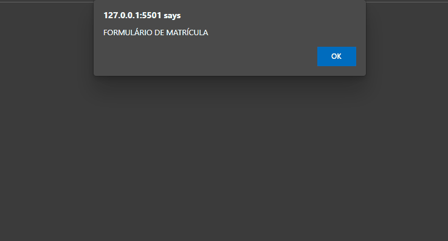

<h1 align="center">Aula 05 - Variáveis e Tipos Primitivos 🗄</h1>

  

  <a href="https://elias-neto.github.io/Curso-em-video-JavaScript/modulos/moduloB/aula05/index.html">Veja o Site</a>

 

## 💻 Projeto

Sistema simples, com o intuito de fazer matrículas, coleta alguns dados do usuário e exiba na tela.

 

## 📥 Conhecimento Adquirido 

- Variáveis;
- Declaração de variáveis;
- Atribuição de valor em variáveis;
- Capturar dados por meio de comando de input `window.prompt()`;
- Concatenação de valores;

 

## 🛠 Tecnologias Usadas

- [HTML](https://www.w3schools.com/html/)
- [CSS](https://www.w3schools.com/css/)
- [JavaScript](https://www.w3schools.com/js/)

 

 Desenvolvido com 💙 por Elias de Araújo Ferreira Neto 👋 

 
  
<a href="../../../README.md">Voltar</a>