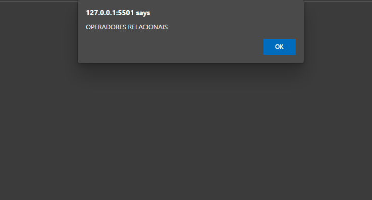

<h1 align="center">Aula 08 - Tratamento de Dados 🔢</h1>

  

  <a href="https://elias-neto.github.io/Curso-em-video-JavaScript/moduloB/aula08/index.html">Veja o Site</a>

 

## 💻 Projeto

Programinhas para praticar operações relacionais, lógicas e ternária.

 

## 📥 Conhecimento Adquirido 

- Operadores Relacionais;
- Operadores Lógicos;
- Operador Ternário.

 

## 🛠 Tecnologias Usadas

- [HTML](https://www.w3schools.com/html/)
- [CSS](https://www.w3schools.com/css/)
- [JavaScript](https://www.w3schools.com/js/)

 

 Desenvolvido com 💙 por Elias de Araújo Ferreira Neto 👋 

 
  
<a href="../../README.md">Voltar</a>