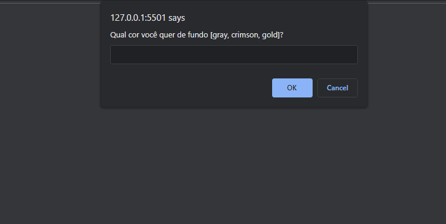

<h1 align="center">Aula 09 - Introdução ao DOM 🖇</h1>

  

  <a href="https://elias-neto.github.io/Curso-em-video-JavaScript/moduloC/aula09/index.html">Veja o Site</a>

 

## 💻 Projeto

Programa que pergunta ao usuário qual cor ele deseja para o fundo da página, para as letras e permite o usuário escrever um título e um parágrafo.

 

## 📥 Conhecimento Adquirido 

- Entendendo o DOM e a Árvore DOM;
- Selecionar elementos da Árvore DOM;
- Manipulação de elementos utilizando o DOM.

 

## 🛠 Tecnologias Usadas

- [HTML](https://www.w3schools.com/html/)
- [CSS](https://www.w3schools.com/css/)
- [JavaScript](https://www.w3schools.com/js/)

 

 Desenvolvido com 💙 por Elias de Araújo Ferreira Neto 👋 

 
  
<a href="../../README.md">Voltar</a>