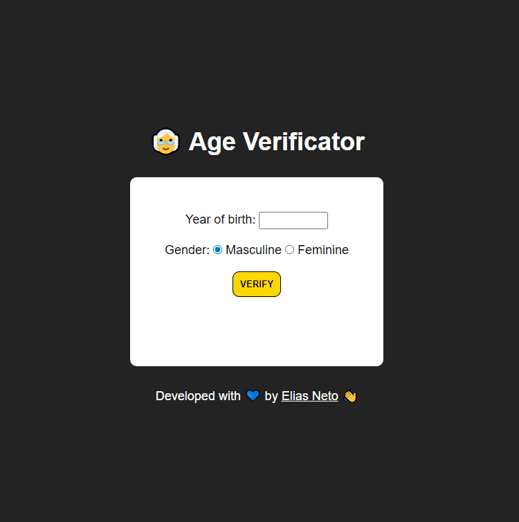

<h1 align="center">Exercícios 🏋️‍♂️</h1>

  

  <a href="https://elias-neto.github.io/Curso-em-video-JavaScript/moduloD/exercicios/exercicio1.html">Veja o Site</a>

 

## 💻 Projeto

Esse aplicativo identifica qual é a hora do seu sistema operacional, informa a hora, e muda a imagem e a saudação (dependendo 
da hora do dia: manhã, tarde e noite).

 

## 📥 Conhecimento Adquirido 

- Manipulação de elementos do DOM;
- Utilização do objeto `Date()`;
- Estrutura Condicional Composta;

 

## 🛠 Tecnologias Usadas

- [HTML](https://www.w3schools.com/html/)
- [CSS](https://www.w3schools.com/css/)
- [JavaScript](https://www.w3schools.com/js/)

 

  

  <a href="https://elias-neto.github.io/Curso-em-video-JavaScript/modulos/moduloD/exercicios/exercicio2.html">Veja o Site</a>

 

## 💻 Projeto

Esse aplicativo identifica ler o ano de nascimento e o gênero do usuário, a partir disso, é calculada e informada a idade do mesmo e ocorre a verificação
se o usuário é criança, jovem, adulto ou idoso (o resultado dessa verificação é informado por meio de uma imagem ilustrativa).

 

## 📥 Conhecimento Adquirido 

- Manipulação de elementos do DOM;
- Utilização do objeto `Date()`;
- Estrutura Condicional Composta;
- Tratamento de dados;
- Criação de elementos com JS por meio do método `document.createElement('tagName')`;
- Setando atributos com JS por meio do método `tagName.setAttribute('attributeName', 'attributeValue')`;
- Anexar um elemento filho a um elemento pré-existente com JS por meio do método `outputDiv.appendChild('childElementName')`

 

## 🛠 Tecnologias Usadas

- [HTML](https://www.w3schools.com/html/)
- [CSS](https://www.w3schools.com/css/)
- [JavaScript](https://www.w3schools.com/js/)

 

 Desenvolvido com 💙 por Elias de Araújo Ferreira Neto 👋 

 
  
<a href="../../../README.md">Voltar</a>